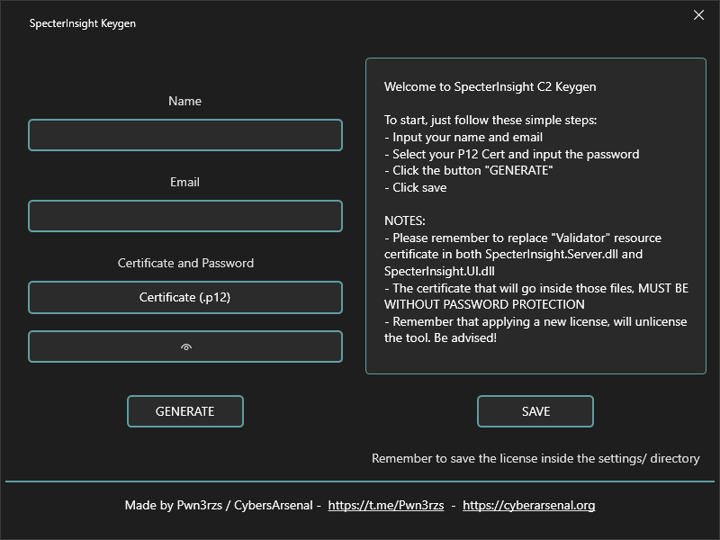

# Specter Insight C2 Keygen

## Setup


#### Be safe

- Edit the hosts file with this values to avoid unnecessary lookups:
```
127.0.0.1 www.practicalsecurityanalytics.com
127.0.0.1 www.practicalsecurityanalytics.com.
127.0.0.1 practicalsecurityanalytics.com
127.0.0.1 practicalsecurityanalytics.com.
::1 www.practicalsecurityanalytics.com
::1 www.practicalsecurityanalytics.com.
::1 practicalsecurityanalytics.com
::1 practicalsecurityanalytics.com.
```

#### Certificate Generation for Keygen

 - Generate EDCSA Key
	- `openssl ecparam -name prime256v1 -genkey -noout -out cert.key`
 - Generate CSR File
	- `openssl req -new -key .\cert.key -out ecdsa_request.csr -subj "/C=RU/ST=Russia/L=Moscow/O=Pwn3rzs/OU=CyberArsenal/CN=Pwn3rzs 'nd CyberArsenal"`
 - Self Sign Certificate
   - `openssl x509 -req -in ecdsa_request.csr -signkey .\cert.key -out cert.pem -days 3650`
 - Export as P12 Certificate
	- `openssl pkcs12 -export -out cert.p12 -inkey .\cert.key -in .\cert.pem -name "SpecterInsight Keygen Cert"`
	- __NOTE__: For the keygen, you can password protect it, but for the replacement it __MUST__ be without password, as the software expects it to be without password.

#### Replace Certificate in Server and Client

 -  With any software that lets you edit .NET Resource Files, replace the resource called `Validator` inside this two DLL:
	- `<base_path>/client/SpecterInsight.UI.dll`
	- `<base_path>/server/SpecterInsight.Server.dll`
 - Replace with your current non password protected P12 certificate and let it keep the name `Validator`
 - Now you're ready to use the keygen.

#### Running the keygen

 - Execute `SpecterInsightKeygen.exe`
 - Follow the guidelines shown by the software.
	- In few words: just put the saved `license.json` file into `<base_path>/settings/` directory.
 - Enjoy!

__NOTE__: To setup the software correctly, just follow the official setup guidelines [here](https://practicalsecurityanalytics.com/specterinsight/tutorials/installation/)


#### Screenshot



## Write Up

- Download the software from original source (must register).
- Once downloaded, extract the archive `SpecterInsight.zip`
- It will have a lot of folders, but we're only interested into:
  - `client/`
  - `server/`
- Starting from the server, we will analyze:
  - `AmsiScanner.Common.dll` which holds encryption / decryption functions
  - `SpecterInsight.Server.dll` which holds the logic for parsing the license
- Now we can check the logic. This is the actual flow:
  - You can find `ImportLicense` that is the actual logic to parse the license file.
```csharp
public LicenseValidationInfoEx ImportLicense(string path)
{
	byte[] array = Utility.Decrypt(File.ReadAllBytes(path), "71eee87b4a514a7196cf10c42eae4af7");
	JsonSerializer serializer = new JsonSerializer();
	serializer.Formatting = Formatting.Indented;
	LicenseValidationInfoEx licenseValidationInfoEx;
	using (MemoryStream ms = new MemoryStream(array))
	{
		using (StreamReader sr = new StreamReader(ms))
		{
			using (JsonTextReader jtr = new JsonTextReader(sr))
			{
				LicenseValidationInfoEx info = serializer.Deserialize<LicenseValidationInfoEx>(jtr);
				if (info == null)
				{
					throw new InvalidDataException("Failed to import license details.");
				}
				if (!this.IsKeyValid(info.Key))
				{
					throw new Exception("This license is not valid. Please visit www.practicalsecurityanalytics.com to purchase a license.");
				}
				if (!info.Validate(info.CustomerEmail))
				{
					throw new Exception("This license is not valid. Please visit www.practicalsecurityanalytics.com to update your license.");
				}
				licenseValidationInfoEx = info;
			}
		}
	}
	return licenseValidationInfoEx;
}
```
   - As you can see, it decrypts with AES the license with the hardcoded key `71eee87b4a514a7196cf10c42eae4af7` then loads the content as JSON.
   - It then uses a static Salt and a Marker
	 - SALT: `new byte[] { 251, 51, 164, 251, 59, 131, 182, 228 };`
	 - MARKER: `new byte[] { 89, 37, 32, 212, 143, 199, 216, 38, 176, 236, 164, 32, 184, 202, 182 };`
   - Decryption code (inside `AmsiScanner.Common.dll`):
```csharp
public static byte[] Decrypt(byte[] ciphertextbytes, string password = "5e16e53245c147a8acd1b3e38de0135d")
{
	Rfc2898DeriveBytes rfc2898DeriveBytes = new Rfc2898DeriveBytes(password, Utility.SALT);
	byte[] array6;
	using (AesCryptoServiceProvider aesCryptoServiceProvider = new AesCryptoServiceProvider())
	{
		aesCryptoServiceProvider.KeySize = 256;
		aesCryptoServiceProvider.BlockSize = 128;
		aesCryptoServiceProvider.Key = rfc2898DeriveBytes.GetBytes(aesCryptoServiceProvider.KeySize / 8);
		byte[] array = new byte[16];
		Array.Copy(ciphertextbytes, array, array.Length);
		aesCryptoServiceProvider.IV = array;
		ICryptoTransform cryptoTransform = aesCryptoServiceProvider.CreateDecryptor(aesCryptoServiceProvider.Key, aesCryptoServiceProvider.IV);
		using (MemoryStream memoryStream = new MemoryStream())
		{
			using (MemoryStream memoryStream2 = new MemoryStream(ciphertextbytes))
			{
				byte[] array2 = new byte[4096];
				memoryStream2.Read(array2, 0, 16);
				using (CryptoStream cryptoStream = new CryptoStream(memoryStream2, cryptoTransform, CryptoStreamMode.Read))
				{
					int num;
					while ((num = cryptoStream.Read(array2, 0, array2.Length)) > 0)
					{
						memoryStream.Write(array2, 0, num);
					}
				}
				byte[] array3 = memoryStream.ToArray();
				byte[] array4 = new byte[Utility.MARKER.Length];
				Array.Copy(array3, array4, array4.Length);
				if (!array4.SequenceEqual(Utility.MARKER))
				{
					throw new Exception("File is not using a supported encryption format.");
				}
				byte[] array5 = new byte[array3.Length - array4.Length];
				Array.Copy(array3, array4.Length, array5, 0, array5.Length);
				array6 = array5;
			}
		}
	}
	return array6;
}
```
   - We can then get the License model from the `ImportLicense` function, as you can read it's actually `LicenseValidationInfoEx` 
   - Now we have all we need to craft the actual license.
   - For simplicity, here is a demo code for that model:
```csharp
LicenseValidationInfoEx licenseValidationInfoEx = new LicenseValidationInfoEx()
{
    ActivationsLeft = "999999",
    CustomerEmail = EmailInput.Text,
    CustomerName = NameInput.Text,
    Expires = DateTime.Now.AddYears(100),
    License = "valid",
    ItemId = "1094",
    ItemName = "CyberArsenal",
    LicenseLimit = "999999",
    PaymentId = 1234,
    PriceId = "1234567890",
    Success = true,
    SiteCount = "999999",
    Key = <licenseKeyEncrypted>
};
```
   - `<licenseKeyEncrypted>` needs to be the Base64 URL Encoded value of the license key, which is split in two values:
	 - `byte[] _data;` 
	 - `byte[] _signature`
     - It then creates a new array of those two values togheter
   - It gets parsed this way:
```csharp
public static LicenseKey Parse(string serialized)
{
	if (serialized.Length > 256)
	{
		throw new FormatException("Invalid key length.");
	}
	byte[] array = WebEncoders.Base64UrlDecode(serialized);
	byte[] data = new byte[16];
	byte[] signature = new byte[array.Length - 16];
	Array.Copy(array, 0, data, 0, 16);
	Array.Copy(array, 16, signature, 0, signature.Length);
	return new LicenseKey(data, signature);
}
```
   - The signature will just be a usual RSA / EDCSA Verification, so nothing really hard to replicate:
```csharp
public bool Validate(X509Certificate2 pkey)
{
	bool flag;
	using (ECDsa ecdsa = pkey.GetECDsaPublicKey())
	{
		flag = ecdsa.VerifyData(this._data, this._signature, HashAlgorithmName.SHA256, DSASignatureFormat.Rfc3279DerSequence);
	}
	return flag;
}
```
   - Pretty easy to re-create, check the keygen's code.
   - Now we have averything to craft our license, let's sum up:
	 - Create a self signed certificate + private key as ECDSA
     - Replace the `Validator` resource in both client and server with our own
     - Run the keygen to generate a valid license
	 - Save the license to Specter Insight setting's folder (`<base_path>/settings/license.json`)
	 - Run the software and enjoy!

## Build
 
#### Requirements
 - .NET 8.0 LTS
 - WPF-UI 
 - Newtonsoft.Json
 - Microsoft.AspNetCore.WebUtilities
 - Visual Studio

#### Release / Debug build

 - Just load `SpecterInsightKeygen.sln` with Visual Studio
 - Choose `Debug` or `Release` and hit Build
 - Enjoy!